# Agent 技术文档：这个项目是怎么工作的

这份文档用尽量直白的方式解释 `Personal Agent Planner` 这个项目。它适合刚开始接触 Agent、Prompt 工程、上下文工程、Harness、记忆系统和 Skills 设计的人阅读。

先把核心点说清楚：当前代码实现的是 **经典 ReAct loop**。

- 模型在每一轮根据当前状态和上一轮 Observation 生成 Thought。
- 模型被要求从当前可用工具里选择一个 Action；后端只接受 `allowedActions` 中的 Action。
- `AgentHarness` 负责限制、包裹执行，并把工具输出或错误记录为 Observation。
- Observation 会进入下一轮 prompt，让模型继续决定下一步，而不是由代码写死完整业务顺序。

你可以先把这个项目理解成一句话：

> 用户输入一个自然语言目标，系统尝试把它拆成任务、日历、网址、建议和文件，并且记录整个 Agent 是如何一步步完成这件事的。

核心代码入口是：

- `apps/server/src/agent/executor.ts`
- `apps/server/src/agent/context.ts`
- `apps/server/src/agent/harness.ts`
- `apps/server/src/skills/*.skill.ts`
- `apps/server/src/skills/definitions/*.skill.md`
- `apps/server/src/memory/*`

## 1. 一张图看懂整体流程

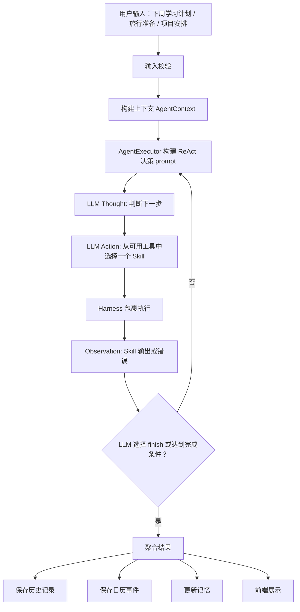

对应到代码，主流程在 `AgentExecutor.run()` 里：

1. 校验输入不能为空。
2. 构建 `AgentContext`。
3. 调用 `createPlan()` 生成计划元数据；当前主要用于保留目标和文件导出语义。
4. 创建 `AgentHarness(10)`，最多允许 10 个被 Harness 包裹的工具步骤。
5. 检查 LLM 是否可用。
6. 进入 ReAct 循环：`AgentExecutor` 把当前状态、可用工具和上一轮 Observation 交给 LLM；LLM 返回 `thought` 和 `action`；后端校验 action 是否可用，然后 `AgentHarness` 执行对应 Skill 并写入 `Observation`。
7. 保存记忆、日历、历史记录。
8. 返回给前端。

## 2. 项目的主要模块

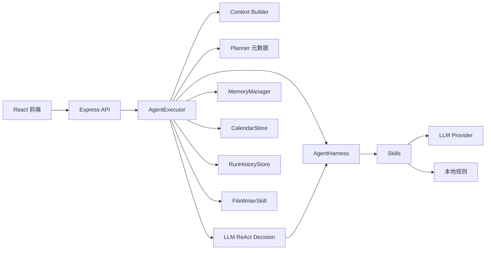

每个模块负责一件事：

- 前端负责输入、展示结果、编辑日历。
- API 负责接收请求。
- `AgentExecutor` 负责串起整个 Agent 流程。
- `Context Builder` 负责准备上下文。
- `Planner` 当前负责生成计划元数据；真正的下一步动作由 ReAct 决策 prompt 交给 LLM 选择。
- `AgentExecutor` 负责维护当前状态、计算可用工具、请求 LLM 选择 Action，并把工具结果写回状态。
- `Harness` 是执行控制层，负责限制步数、包裹 Skill 调用、统一错误处理，并在这个过程中产出可观测日志。
- `Skills` 负责具体能力。
- `MemoryManager` 负责记忆检索和保存。
- `CalendarStore`、`RunHistoryStore` 负责持久化。

## 3. 什么是 Prompt 工程

Prompt 工程不是简单写一句“请帮我规划”。在这个项目里，Prompt 工程有三个目标：

1. 告诉模型扮演什么角色。
2. 告诉模型必须遵守哪些规则。
3. 要求模型输出程序能解析的数据，并在解析失败时有清晰的重试或失败路径。

### 3.1 任务拆解 Prompt

相关文件：

- `apps/server/src/skills/taskDecomposer.skill.ts`
- `apps/server/src/skills/definitions/task-decomposer.skill.md`

任务拆解 Skill 会让模型做这件事：

> 把用户的自然语言目标拆成结构化任务数组。

它的 prompt 会要求模型：

- 只围绕用户输入拆任务。
- 不要输出空泛任务，比如“明确目标”“制定计划”。
- 每个任务都要有标题、描述、优先级、预计时间、依赖和标签；截止日期只有在用户给出明确日期或模型能合理推断时才出现。
- 如果用户提到了地点、时间、数量，要体现在任务里。
- 输出 JSON，不要输出随意文本。

流程如下：

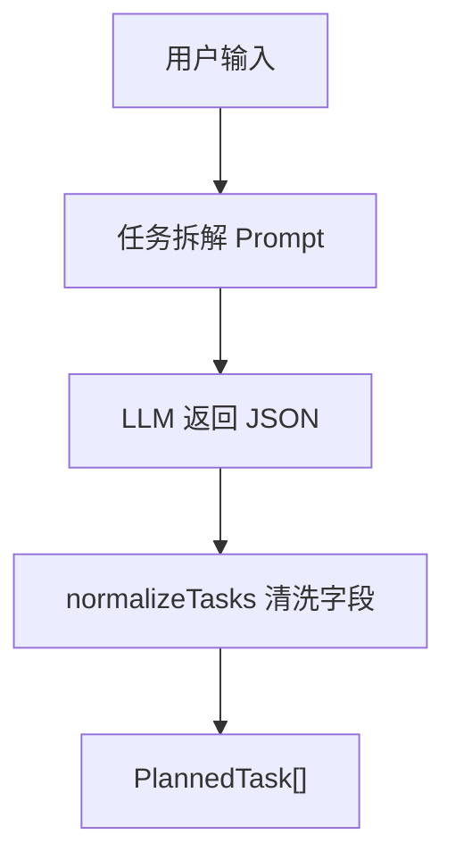

为什么要清洗字段？因为 LLM 可能输出不完整或格式不稳定。代码里会做这些处理：

- 没有标题时给默认标题。
- 优先级不合法时改成 `medium`。
- 预计时间限制在合理范围内。
- `dueDate` 如果存在，必须符合 `YYYY-MM-DD`；不合法时会被丢弃。
- 最多保留 10 个任务。

这就是工程里的安全垫。

### 3.2 JSON 输出和自动修复

相关文件：

- `apps/server/src/llm/openaiProvider.ts`

`generateJSON()` 会给模型追加格式要求：

- 只能返回合法 JSON。
- 不要解释。
- 不要 Markdown 代码块。
- 必须以 `[` 或 `{` 开头。
- 按 `schemaHint` 输出。

如果模型第一次没返回合法 JSON，代码会自动重试。

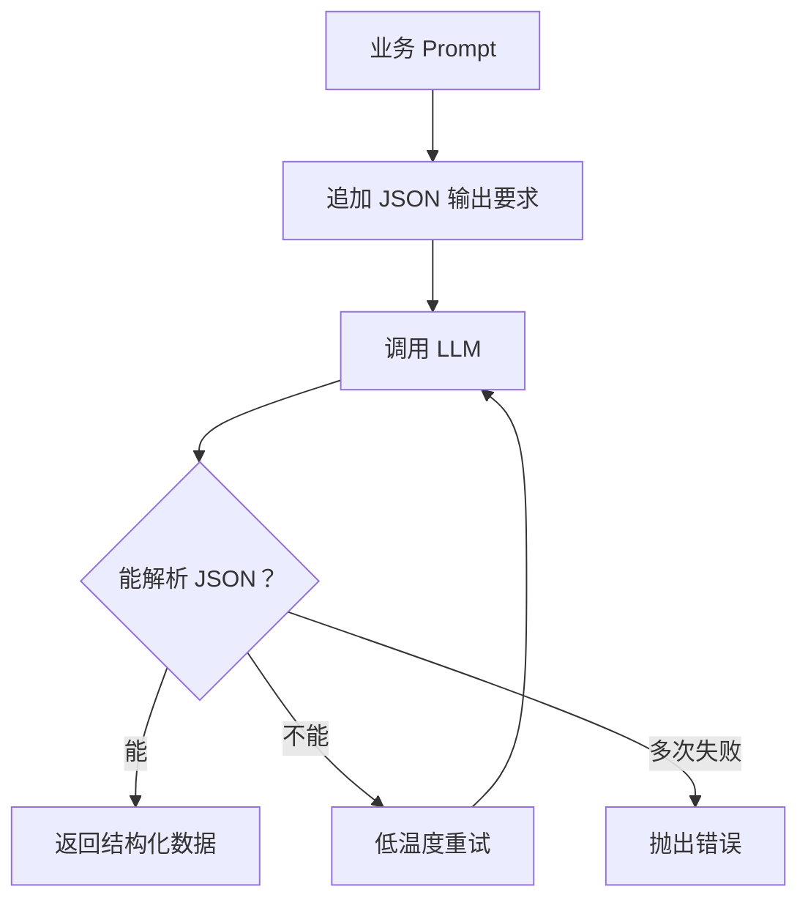

这很重要，因为真实项目里不能假设模型永远听话。

### 3.3 建议生成 Prompt

相关文件：

- `apps/server/src/skills/recommendation.skill.ts`
- `apps/server/src/skills/definitions/recommendation.skill.md`

建议生成 Skill 不只看任务，还会看用户原始目标：

```ts
interface RecommendationInput {
  goal: string;
  tasks: PlannedTask[];
  events: CalendarEvent[];
}
```

这样做是因为任务拆解后的结构化数据可能丢掉一些语气和背景。比如用户说“我想轻松一点安排大阪旅行”，这个“轻松一点”可能不会完整出现在任务标题里，但原始输入里还在。

旅行场景里，Prompt 还特别限制模型不要乱编：

- 可以推荐候选城市、区域、景点类型。
- 但要说成“可候选”“可优先调研”。
- 不要编造实时价格。
- 不要编造营业时间。
- 不要编造签证政策。
- 不要编造交通班次。
- 不要编造具体网址。
- 涉及不稳定信息时，提醒用户二次核验。

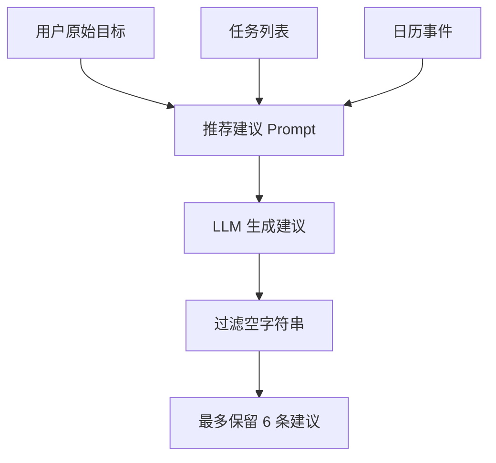

### 3.4 最终总结 Prompt

相关文件：

- `apps/server/src/agent/executor.ts`

`generateFinalAnswer()` 负责生成最后给用户看的总结。它会把这些信息交给模型：

- 用户原始输入。
- 拆出来的任务。
- 生成的建议。

它要求模型用 2-3 句话总结，并指出关键执行要点和风险。

## 4. 什么是上下文工程

上下文工程就是：在模型执行前，给它准备刚刚好的信息。

不是信息越多越好。信息太少，模型不知道背景；信息太多，模型容易混乱、成本也更高。

本项目的上下文对象叫 `AgentContext`。

相关文件：

- `apps/server/src/agent/context.ts`
- `apps/server/src/agent/types.ts`

```ts
export interface AgentContext {
  runId: string;
  input: string;
  now: string;
  memories: MemoryItem[];
}
```

图示如下：

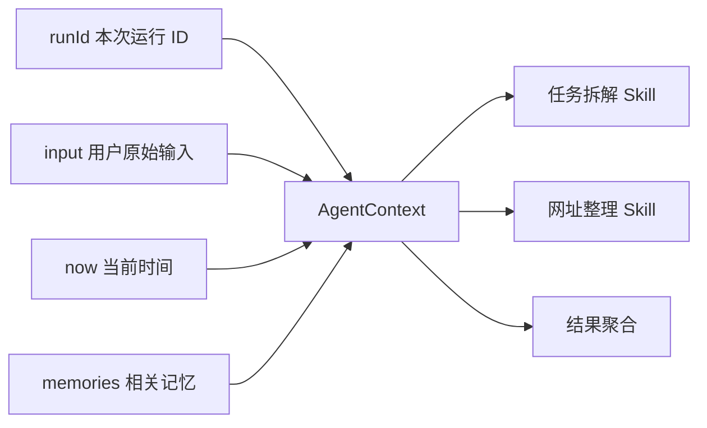

这四个字段分别解决不同问题：

- `runId`：让文件、历史、日历能关联到同一次运行。
- `input`：保留用户原始意图。
- `now`：让日程规划知道当前时间。
- `memories`：让 Agent 能记住用户偏好。

## 5. 原始输入和结构化数据为什么都要保留

一个常见误区是：只要把用户输入拆成任务，就不需要原始输入了。

这个项目没有这么做。它会同时保留：

- 原始输入 `input`
- 结构化任务 `tasks`
- 日历事件 `calendarEvents`

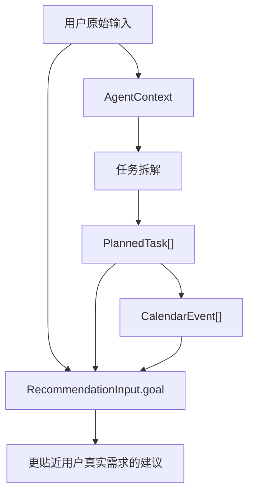

原始输入保留语义和语气，结构化数据方便程序处理。两者一起用，效果更稳。

## 6. Agent Harness 和经典 ReAct Loop 是什么

相关文件：

- `apps/server/src/agent/harness.ts`
- `apps/server/src/agent/types.ts`

经典 ReAct 的核心是：

```text
Thought -> Action -> Observation -> Thought -> Action -> Observation ...
```

也就是 Agent 先说明“我为什么要做下一步”，再调用一个动作，最后观察动作结果。

当前项目采用经典 ReAct loop：下一步 Action 由 LLM 在每轮从可用工具里选择，代码负责校验可选范围、执行工具、保存 Observation 和维护结构化状态。

Harness 可以理解成 Agent 的“执行外壳”或“运行约束层”。它不负责思考，也不负责决定下一步业务动作；它负责安全地执行每一个被模型选中的 Skill 调用。

它做这些事：

1. 限制最多执行几步。
2. 在执行前创建 step log。
3. 包裹 `skill.execute(input)`。
4. 成功时把输出摘要写成 `Observation`。
5. 失败时把错误信息写成 `Observation`。
6. 记录开始时间、结束时间、成功或失败状态。

因此，更严谨的说法是：**Harness 的核心职责是执行约束和调用管理；日志是它为了可观测性在执行过程中产生的 trace。**

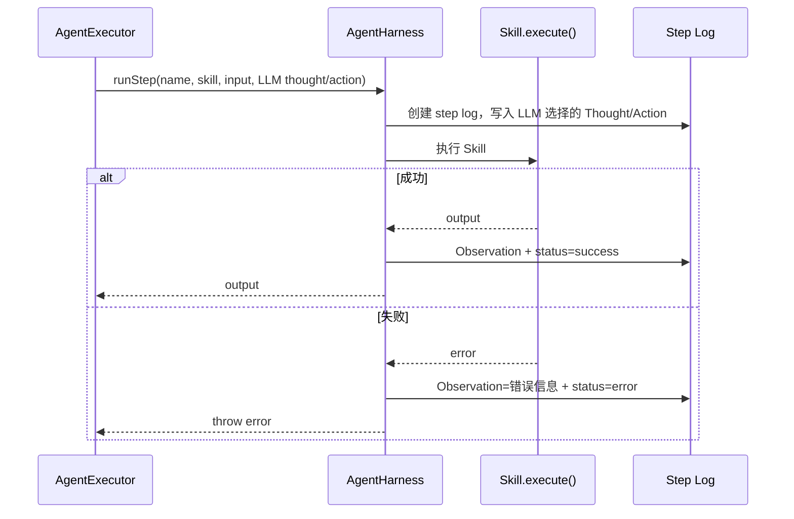

### 6.1 最大步数限制

`AgentExecutor` 中创建：

```ts
const harness = new AgentHarness(autonomousStepLimit);
```

`AgentHarness` 内部会检查：

```ts
if (this.steps.length >= this.maxSteps) {
  throw new Error(`Agent exceeded max steps: ${this.maxSteps}`);
}
```

这避免 Agent 无限执行。

### 6.2 Step Log 中哪些字段是谁产生的

每一步都会生成日志，结构类似：

```ts
{
  id: "1",
  name: "任务拆解",
  skillName: "task_decomposer",
  status: "running",
  thought: "我需要先理解用户目标，并把自然语言需求变成可执行任务。",
  action: "task_decomposer",
  inputSummary: "...",
  startedAt: "...",
  usedLLM: true
}
```

执行结束后，会补上：

- `status`
- `outputSummary`
- `observation`
- `error`
- `endedAt`

字段来源要区分清楚：

- `thought`：由 LLM 在 ReAct 决策轮生成，不是 Harness 自己思考出来的。
- `action`：由 LLM 从当前可用工具中选择，通常对应要调用的 Skill。
- `observation`：由 `AgentHarness` 根据 Skill 执行结果或错误生成。
- `status` / `startedAt` / `endedAt`：由 `AgentHarness` 管理。
- `usedLLM`：由 `AgentExecutor` 判断后传入 Harness。

前端的 ReAct 执行日志就是从这些字段来的。

### 6.3 ReAct 决策 prompt 如何约束工具

相关代码在 `apps/server/src/agent/executor.ts` 的 `decideNextAction()`。

每一轮 prompt 会给模型这些信息：

- 用户原始输入。
- 当前时间和相关记忆。
- 当前结构化状态，例如任务数量、是否已有最终回答、文件数量。
- 上一轮 Observation。
- 当前可用工具列表。
- `allowedActions` 白名单。

模型必须返回 JSON：

```json
{
  "thought": "说明为什么选择下一步",
  "action": "task_decomposer",
  "reason": "可选的简短说明"
}
```

`AgentExecutor` 会校验 action 是否在 `allowedActions` 里。如果模型返回格式错误或选了不可用工具，代码会使用保守的确定性 fallback 选择下一步，以降低一次决策输出不稳导致运行中断的概率。

## 7. LLM 步骤和本地步骤怎么区分

不是所有步骤都应该交给 LLM。

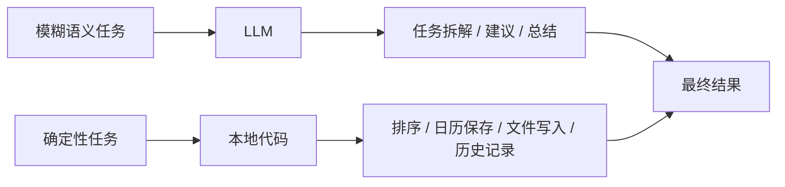

适合 LLM 的任务：

- 理解自然语言。
- 拆解目标。
- 给出场景化建议。
- 写自然语言总结。

适合本地代码的任务：

- 排序。
- 保存日历。
- 写文件。
- 保存历史记录。
- 删除或编辑日历事件。

这样设计的好处是：LLM 负责理解、决策和生成，本地代码负责可控的状态变更。

## 8. 记忆系统怎么工作

相关文件：

- `apps/server/src/memory/memoryManager.ts`
- `apps/server/src/memory/memoryStore.ts`
- `apps/server/src/routes/memory.routes.ts`

记忆系统分两层：

- `MemoryStore`：负责读写 `data/memories.json`。
- `MemoryManager`：负责检索、更新和推断记忆。

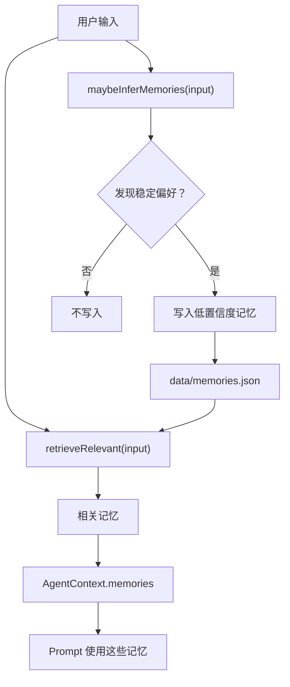

### 8.1 MemoryItem

记忆的数据结构是：

```ts
export interface MemoryItem {
  id: string;
  type: "preference" | "habit" | "constraint" | "profile" | "project" | "other";
  key: string;
  value: string;
  confidence: number;
  source: "user_explicit" | "agent_inferred";
  createdAt: string;
  updatedAt: string;
}
```

重点是两个字段：

- `confidence`：可信度。
- `source`：记忆来源。

如果是 Agent 自己推断出来的记忆，代码会设置：

```ts
confidence: 0.45,
source: "agent_inferred"
```

这表示：Agent 可以猜测用户偏好，但不能把猜测当成确定事实。

### 8.2 相关记忆检索

`retrieveRelevant(input)` 会：

1. 读取所有记忆。
2. 判断用户输入是否包含记忆的 `key` 或 `value`。
3. 默认保留偏好类记忆。
4. 最多取 8 条。

这是一个轻量版本的记忆检索。它没有用向量数据库，但已经体现了“不要把全部记忆都塞进 prompt”的原则。

## 9. Skills 是什么

Skill 可以理解成 Agent 的一个能力模块。

比如：

- 任务拆解是一个 Skill。
- 优先级排序是一个 Skill。
- 日历规划是一个 Skill。
- 网址整理是一个 Skill。
- 文件生成是一个 Skill。

项目里的 Skill 分成两部分：

1. Markdown 定义文件：描述这个 Skill 应该做什么。
2. TypeScript runtime：真正执行这个 Skill。

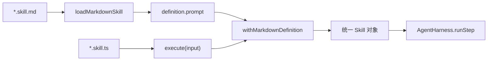

### 9.1 Markdown Skill

相关目录：

- `apps/server/src/skills/definitions/`

一个 Markdown Skill 大概长这样：

```md
---
name: task_decomposer
title: 任务拆解 Skill
description: 将用户的自然语言目标拆解成可执行任务。
input: AgentContext
output: PlannedTask[]
---

## 规则

- 每个任务必须包含 title、description、priority、estimatedMinutes、dependencies 和 tags；有明确截止日期时再包含 dueDate。
```

frontmatter 里的字段是机器可读信息：

- `name`
- `title`
- `description`
- `input`
- `output`

正文是给 LLM 和开发者看的规则。

### 9.2 Runtime Skill

相关文件：

- `apps/server/src/skills/*.skill.ts`

所有 runtime Skill 都符合这个接口：

```ts
export interface Skill<I, O> {
  name: string;
  description: string;
  execute(input: I): Promise<O>;
}
```

这表示不同 Skill 可以有不同输入输出，但都能被 Harness 统一执行。

### 9.3 Markdown 和 Runtime 怎么绑定

相关文件：

- `apps/server/src/skills/markdownSkill.ts`
- `apps/server/src/skills/index.ts`

绑定方式是：

```ts
export const taskDecomposerSkill =
  withMarkdownDefinition(taskDecomposerRuntime, "task-decomposer.skill.md");
```

绑定后，一个通过 `withMarkdownDefinition()` 包装的 Skill 同时拥有：

- Markdown 里的 `name`
- Markdown 里的 `description`
- Markdown 正文 `definition.prompt`
- TypeScript 的 `execute()`

所以 Markdown 记录“做什么”和行为约束，TypeScript runtime 决定“怎么执行”和如何处理输出。

## 10. 如果新增一个 Skill，要做什么

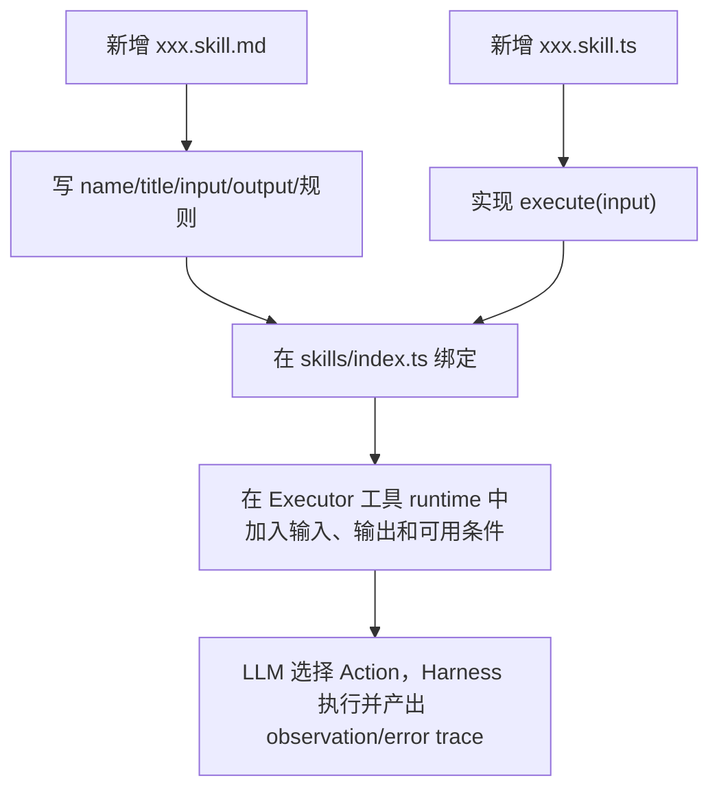

这就是项目的扩展点。新增能力时，通常不需要重写整个 Agent，但需要把新 Skill 注册到工具 runtime，并明确它何时可用、如何写回状态、失败后如何处理。

## 11. 结果结构是什么

一次 Agent 运行最后返回 `HarnessRunResult`。

相关文件：

- `apps/server/src/agent/types.ts`

```ts
export interface HarnessRunResult {
  runId: string;
  agentPattern: "react";
  steps: AgentStepLog[];
  finalAnswer: string;
  tasks: PlannedTask[];
  calendarEvents: CalendarEvent[];
  urls: UrlReference[];
  files: GeneratedFile[];
  memoriesUsed: MemoryItem[];
  recommendations: string[];
  llmStatus?: LLMStatus;
}
```

图示如下：

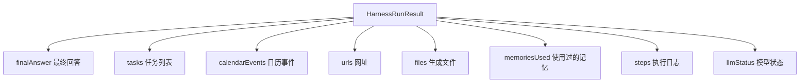

`agentPattern: "react"` 表示返回结果包含经典 ReAct 的 Thought / Action / Observation 执行轨迹。

这说明项目返回的不只是一段文字，而是结构化结果。某些数组可能为空，例如模型没有选择文件生成工具、关闭了日历生成，或 LLM 不可用导致完整 ReAct 循环没有启动。

## 12. 降级策略

相关文件：

- `apps/server/src/llm/index.ts`
- `apps/server/src/llm/openaiProvider.ts`

项目会根据是否配置 `LLM_API_KEY` 选择 Provider：

- 有配置时使用 `OpenAICompatibleProvider`。
- 没配置时使用 `MockProvider`。

运行前还会调用 `testLLMConnection()` 检查模型是否真的可用。

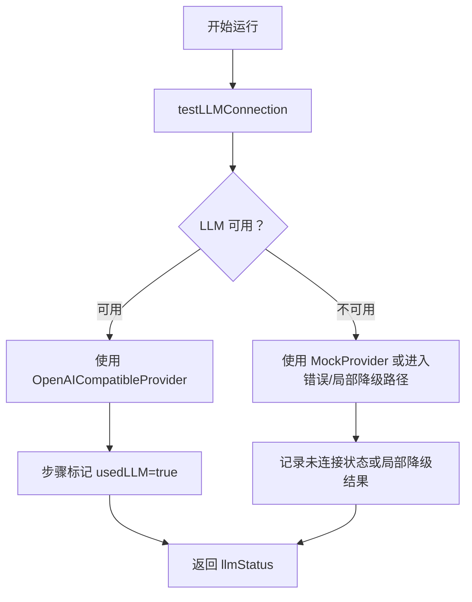

这里要注意一个边界：后端服务不会因为没有 API Key 就无法启动，但经典 ReAct 的工具选择和部分业务工具依赖 LLM。`prioritySorter`、`calendarPlanner`、`fileWriter` 等工具本身是本地确定性逻辑；`taskDecomposer`、`urlCollector`、`recommendation` 和 `finalAnswer` 属于 LLM 依赖更强的工具。`MockProvider` 提供的是 provider 层占位能力，不等于每个业务 Skill 都已经有完整本地 fallback。

## 13. 前端如何使用 Agent 输出

相关文件：

- `apps/web/src/pages/Dashboard.tsx`
- `apps/web/src/components/CalendarView.tsx`
- `apps/web/src/lib/api.ts`

前端展示的不只是聊天文本，而是完整工作台：

- LLM 连接状态。
- 最终总结。
- 任务列表。
- URL 列表。
- 可编辑日历。
- 生成文件。
- 执行日志。

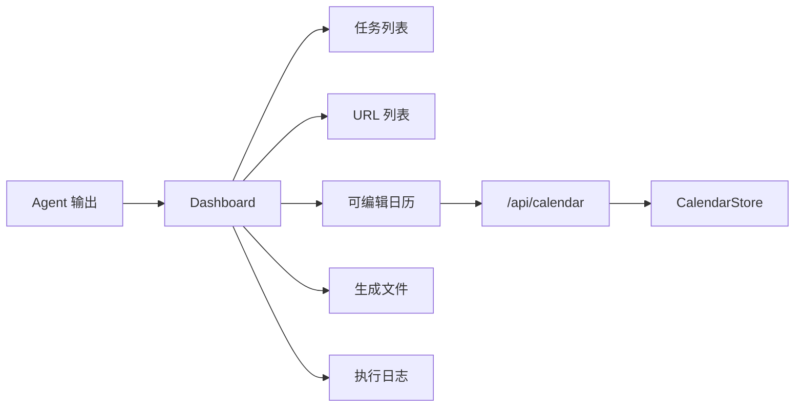

日历组件 `CalendarView` 可以：

- 读取 `/api/calendar`。
- 新增事件。
- 编辑事件。
- 删除事件。
- 展示历史记录中的只读日历快照。

## 14. 为什么这算一个 Agent 项目

这个项目体现 Agent 的地方在于：

1. 它不是只调用一次模型，而是把目标拆成多个步骤。
2. 它会构建上下文，把输入、时间和记忆组合起来。
3. 它采用经典 ReAct 的 Thought/Action/Observation 循环暴露执行轨迹，并用 `allowedActions` 约束模型可选动作。
4. 它有 Skills，把复杂能力拆成可组合模块。
5. 它会区分 LLM 任务和本地确定性任务。
6. 它有记忆系统，可以跨运行保留用户偏好。
7. 它能把结果保存成历史记录，并在对应工具被调用时保存日历事件和生成文件。
8. 它有防幻觉约束，尤其是旅行推荐这种容易编造事实的场景。

可以把它理解成一个小型 Agent Runtime：

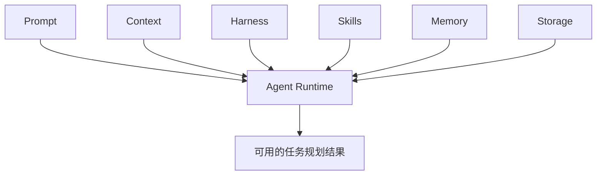

每一层的职责是：

- Prompt：让模型按规则生成内容。
- Context：给模型和 Skill 提供必要背景。
- Harness：限制执行边界、包裹 Skill 调用、统一错误处理，并产生可观测 trace。
- Skills：把复杂任务拆成多个能力。
- Memory：保存和检索用户偏好。
- Storage：把结果保存成可以继续使用的数据。
